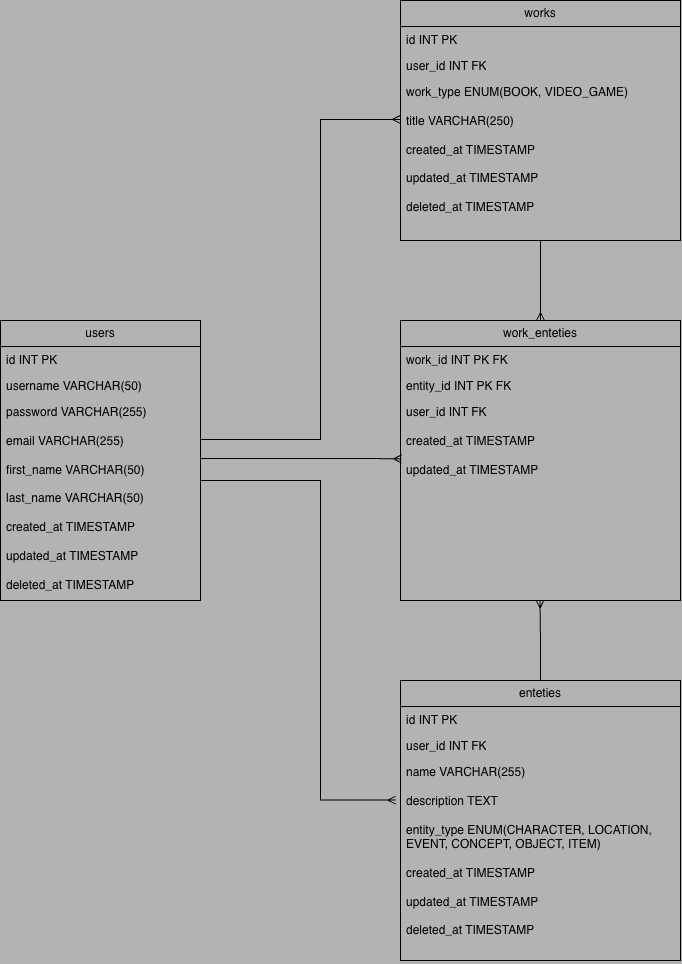

# Planning

This folder documents the planning and design decisions for the Lore Lens MVP.
It is intentionally separate from implementation code.

## MVP Scope
- User Authentication
- User owned works
- Knowledge entities
- Linking works to entities
- Search for works and entities 

Out of scope for MVP:
- Sharing / collaboration
- Movies, TV, research papers
- Public profiles
- Relationships

## Figma Mocks

[Figma Mocks](https://www.figma.com/design/oKXStg091VJ82UZaNsx9Lb/Lore-Lens-Mocks?node-id=0-1&p=f)

## DB 

The MVP uses a normalized relational model to support:
- User-owned data
- Many-to-many relationships between works and entities
- Future expansion into additional media types

## Endpoints

### AUTHENTICATION
- POST /auth/register -> Creates a new user
- POST /auth/login -> User Login
- GET /auth/me -> user about page

### WORKS
- POST /works -> creates a new work
- GET /works -> lists all works
- GET /works/{work_id} -> lists a single work
- PUT /works/{work_id} -> edits a work

### ENTITIES
- POST /entities -> creates a new entity
- GET /entities -> lists all entities
- GET /entities//{entity_id} -> lists a single entity
- PUT entities/{entity_id} -> edits an entity

### WORK ENTITIES
- POST /works/{work_id}/entities/{entity_id} -> links a work to an entity
- GET /works/{work_id}/entities -> lists a works entities
- GET /entities/{entity_id}/works -> lists an entities works
- DELETE /works/{work_id}/entities/{entity_id} -> deletes a work entity relationship

## Design Decisions

- REST API chosen for simplicity and clarity
- JWT-based authentication for stateless sessions
- Knowledge entities modeled separately to allow reuse across works
- Planning-first approach before implementation